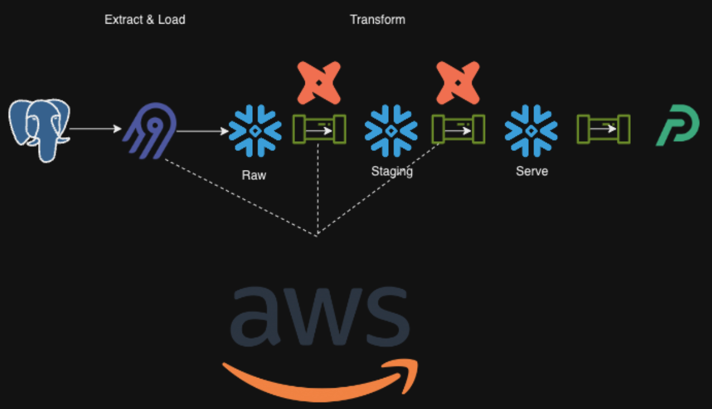
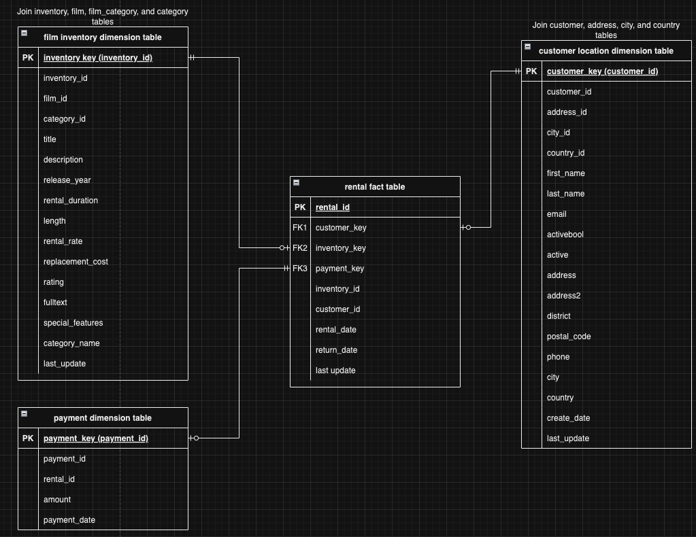

# DEC-P2-dvd-rental

## Objective
Our objective was to create a database with a curated set of movies for customers by country and category. We aspire to get the data to a state in which it will be ready to be used for Analytics, ML etc. In this case we will obtain key insights thanks to the Transformation &  Data Modelling techniques used & visualize it in Preset. We strive to provide insights for consumers and streaming companies about what DVDs are most in demand. This project will utilize the Dvd Rental Database. We are modeling the rental behavior of customers.

## Solution architecture
We are using airbyte to ingest data into snowflake where dbt will be used for data modeling. We will use AWS to run orchestration and Preset to visualize our insights.

## Data Integration

## Data Transformation
These transformations will create a staging schema called `staging` where only relavant tables from the dvd_rentals database will appear which have been cleaned and tested(unique, not null, relationships, and accepted values) to ensure transformations will work.

The serve layer includes a fact table based on rentals(`rental_fact`) and 3 dimension tables (Customer Location details `cust_loc_dim`, Rental Film Inventory details `film_inv_dim`, Rental Payment details `payment_dim`) upon which you can merge with keys. One big table is also avaliable in the `report_rental` table in our serve layer called `marts` . An Entity Relationship diagram is provided below for details.

### Running the Data Transformation model
To run the model follow the instructions below.
You will need dbt-core and dbt-snowflake packages installed.
The dbt data model is named decproj2 and is stored in the data_model/decproj2 directory of this repo. 

Step 1 - On your snowflake account make sure you have a database loaded with a schema with the tables you want to use(data ingestion would get you here). Make sure you have assigned a warehouse and warehouse name you want to use and are using the accountadmin role.

Step 2 - Configure the `profiles.yml` file with your snowflake credentials. Replace the `account` with your snowflake account, the `database` with your database name in snowflake, the `schema` with your schema in the snowflake db, and your `warehouse` name you want to use on your snowflake account.

Step 3 - Set local environment variables `SNOWFLAKE_PASSWORD` and `SNOWFLAKE_USERNAME` in your machine's terminal to your snowflake account's credentials.

Step 4 - navigate (cd) to the `decproj2` directory and run `dbt deps` to install dependent packages, `dbt debug` to ensure your snowflake connection it working, and `dbt test` to make sure all requirements of the data are being met for the transformations to work.

Step 5 - run `dbt run` to run the transformation! They should appear in your snowflake database now.

## Data Orchestration
We used a bash script named orchestrate.sh for orchestration.  This orchestrator responsible for running the workflow and calling each step in the correct order.

## BI Tool: Preset
Preset is the BI tool we chose to create visualizations and analysis of our transformed data.